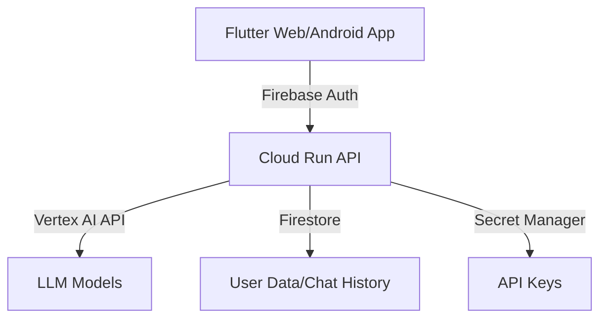

# Chat Reflection Loop
フロントエンドにFlutter、バックエンドにFastAPI、インフラにGoogle Cloudを使用したLLMチャットアプリケーションのプロジェクトです。Firebase AuthenticationとFirestoreを活用し、セキュアで拡張性の高いアーキテクチャを実現しています。

## アーキテクチャ概要



## 主要コンポーネント

### 1. フロントエンド (/frontend)
- Flutter Webアプリケーション
- Android用ビルド対応
- Firebase Hosting対応
- レスポンシブなチャットUI
- Firebase Authentication統合

### 2. バックエンド (/backend)
- FastAPIベースのRESTful API
- Firebase認証による保護
- チャット履歴管理
- ユーザープロファイル分析
- 振り返り機能

### 3. インフラストラクチャ (/iac)
- Terraformによる完全自動化されたデプロイ
- Google Cloud Run
- Firebase設定
- Secret Manager統合
- スケーラブルな設計

## 技術スタック

- **フロントエンド**
  - Flutter Web/Android
  - Firebase Authentication
  - Server-Sent Events (SSE)

- **バックエンド**
  - FastAPI
  - Vertex AI
  - Firebase Admin SDK
  - Firestore

- **インフラストラクチャ**
  - Google Cloud Run
  - Firebase Hosting
  - Terraform
  - Secret Manager

## 開発環境のセットアップ

### 1. 必要な環境

- Flutter SDK
- Python 3.11以上
- Terraform
- Google Cloud SDK
- Firebase CLI
- Docker

### 2. リポジトリのクローン

```bash
git clone [repository-url]
cd google_cloud_llm_hackathons
```

### 3. バックエンドのセットアップ

```bash
cd backend
cp .env.sample .env
# .envファイルを編集し、必要な環境変数を設定

# Dockerでの実行
docker compose up -d
```

### 4. フロントエンドのセットアップ

```bash
cd frontend/flutter_web_app
cp .env.sample .env
# .envファイルを編集

# 開発サーバーの起動
cd scripts
./serve_local.sh
```

### 5. インフラストラクチャのセットアップ

```bash
cd iac/terraform
cp terraform.tfvars.example terraform.tfvars
# terraform.tfvarsを編集し、必要な変数を設定

terraform init
terraform plan
terraform apply
```

## デプロイ

### 1. バックエンドのデプロイ

バックエンドのデプロイはTerraformで自動化されています。
詳細は `/iac/README.md` を参照してください。

### 2. フロントエンドのデプロイ

```bash
cd frontend/flutter_web_app/scripts
./build_web.sh  # Firebase Hostingへのデプロイ
# または
./build_android.sh  # Androidアプリのビルド
```

## ドキュメント

詳細なドキュメントは各コンポーネントのREADMEおよび `/docs` ディレクトリを参照してください：

- [フロントエンドドキュメント](/frontend/README.md)
- [バックエンドドキュメント](/backend/README.md)
- [インフラストラクチャドキュメント](/iac/README.md)

## ライセンス

このプロジェクトは[MITライセンス](LICENSE)の下で公開されています。