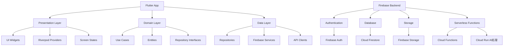

# Firebase/Flutter生成AIアプリケーション アーキテクチャ設計書

## 目次
- [1. システム概要](#1-システム概要)
- [2. セキュリティ設計](#2-セキュリティ設計)
- [3. データモデル](#3-データモデル)
- [4. スケーラビリティ設計](#4-スケーラビリティ設計)
- [5. 開発フロー・環境](#5-開発フロー環境)
- [6. 監視・ロギング](#6-監視ロギング)
- [7. 今後の拡張性](#7-今後の拡張性)

## 1. システム概要

### 1.1 アーキテクチャの全体像



### 1.2 主要コンポーネント詳細

#### A. フロントエンド (Flutter)
- **アーキテクチャパターン**: クリーンアーキテクチャ
- **状態管理**: Riverpod 2.x
- **依存性管理**:
  - flutter_riverpod
  - freezed
  - go_router
  - json_serializable

#### B. バックエンド (Firebase)
- **認証**: Firebase Authentication
  - メール/パスワード認証
  - ソーシャルログイン（Google, Apple）
- **データベース**: Cloud Firestore
  - NoSQLデータモデル
  - リアルタイム同期
- **ストレージ**: Firebase Storage
  - メディアファイル保存
  - 生成AI用の入力データ

#### C. AI処理層 (Cloud Run + VertexAI)
- **処理エンジン**: Cloud Run
- **AI Model**: VertexAI
- **スケーリング**: オートスケーリング対応

## 2. セキュリティ設計

### 2.1 認証・認可
- Firebase Authentication による認証
- Cloud Firestore のセキュリティルール
- Cloud Storage のセキュリティルール

### 2.2 データ保護
- データの暗号化（保存時・通信時）
- センシティブデータの分離保存
- アクセス制御の階層化

## 3. データモデル

### 3.1 Core Entities

```dart
// User Entity
class User {
  final String id;
  final String name;
  final String email;
  final List<String> generatedContent;
}

// AIGeneration Entity
class AIGeneration {
  final String id;
  final String userId;
  final String prompt;
  final String result;
  final DateTime createdAt;
  final GenerationStatus status;
}
```

### 3.2 Firestore コレクション構造

```
/users/{userId}
  - personalData
  - settings

/generations/{generationId}
  - prompt
  - result
  - metadata

/user-generations/{userId}/generations/{generationId}
  - quick access link
```

## 4. スケーラビリティ設計

### 4.1 パフォーマンス最適化
- Firestore インデックス最適化
- 画像の最適化とキャッシング
- ページネーションの実装

### 4.2 コスト最適化
- Cloud Run のコールドスタート対策
- Firestoreクエリの最適化
- キャッシュ戦略の実装

## 5. 開発フロー・環境

### 5.1 環境構成

```
- Development
  - Firebase Emulator
  - ローカルAI開発環境

- Staging
  - Firebase Project (Staging)
  - 検証用AI環境

- Production
  - Firebase Project (Production)
  - 本番AI環境
```

### 5.2 CI/CD
- GitHub Actions による自動化
- Firebase App Distribution
- 自動テスト実行

## 6. 監視・ロギング

### 6.1 監視項目
- Firebase Performance Monitoring
- Cloud Run メトリクス
- エラーレポート

### 6.2 ロギング
- Firebase Analytics
- Cloud Logging
- カスタムメトリクス

## 7. 今後の拡張性

### 7.1 スケールアップ対応
- マルチモデル対応
- バッチ処理対応
- WebSocket対応

### 7.2 機能拡張性
- オフライン対応
- プッシュ通知
- バックグラウンド処理