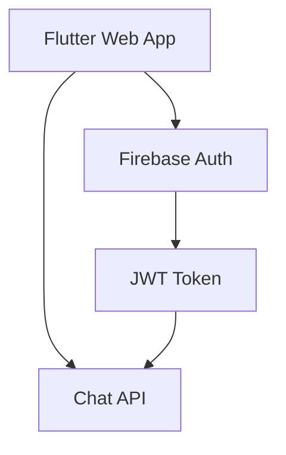

# Firebase/Flutter生成AIアプリケーション アーキテクチャ設計書 (MVP版)

## 1. システム概要

### 1.1 MVPの範囲
- メール/パスワードによるFirebase認証
- チャットインターフェース
- APIを使用した基本的なチャット機能

### 1.2 シンプルなアーキテクチャ


## 2. 実装構造 (MVP)

### 2.1 最小限のプロジェクト構造
```
frontend/
  ├── lib/
  │   ├── main.dart
  │   ├── auth_service.dart    # Firebase認証
  │   ├── chat_service.dart    # APIクライアント
  │   ├── login_page.dart      # ログイン画面
  │   └── chat_page.dart       # チャット画面
  └── pubspec.yaml
```

### 2.2 必要最小限の依存パッケージ
- firebase_core
- firebase_auth
- http (APIクライアント)
- provider (簡易な状態管理)

## 3. 機能実装 (MVP)

### 3.1 認証機能
- メール/パスワードログインのみ
- JWTトークンの取得
- 基本的なエラーハンドリング

### 3.2 チャット機能
- シンプルなチャットUI
- テキストメッセージの送受信
- 基本的なローディング表示

## 4. 実装ステップ

### Phase 1: 基本セットアップ (1-2日)
1. Flutter Webプロジェクト作成
2. 必要な依存関係の追加
3. Firebase設定

### Phase 2: 認証実装 (1-2日)
1. ログイン画面の作成
2. Firebase認証の実装
3. JWTトークン取得

### Phase 3: チャット実装 (2-3日)
1. チャット画面の作成
2. APIクライアントの実装
3. メッセージ送受信機能

## 5. 簡易セキュリティ対策
- JWTトークンのメモリ保持
- 基本的な入力値チェック

## 6. 開発環境
- ローカル開発環境
- Firebase Emulator (オプション)

## 7. 将来の拡張性
- ソーシャルログイン追加
- メッセージ履歴保存
- UI/UXの改善
- エラーハンドリングの強化
- テストの追加