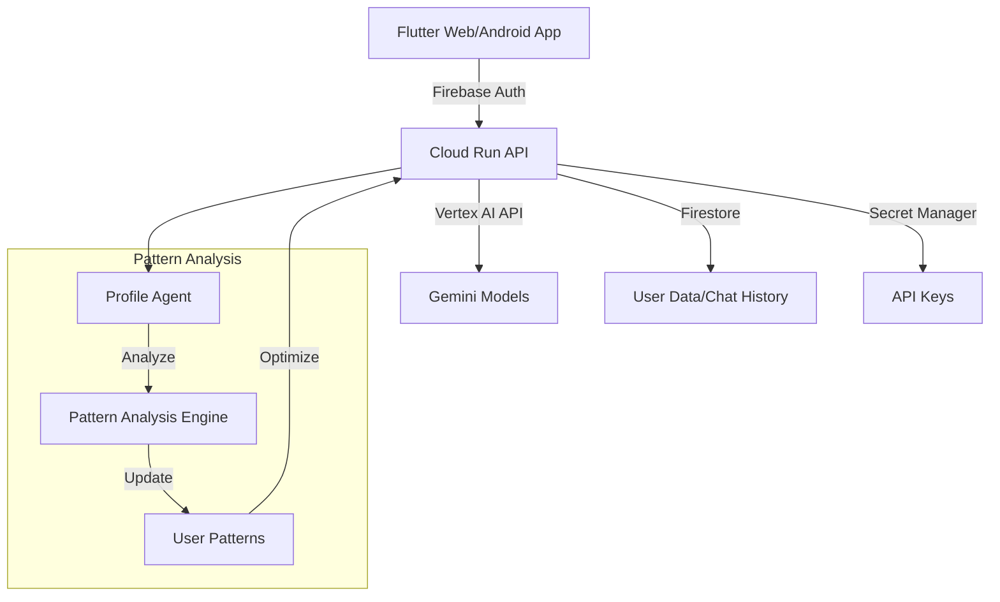

# Gemini in the Loop - LLMとの対話から始まる自己理解と成長の旅

## はじめに

近年、ChatGPTやGemini等のLLMの発展により、人々はAIとの対話を日常的に行うようになりました。しかし、多くのユーザーは同じような質問を繰り返したり、過去の会話から学びを得られていないという課題があります。

「Gemini in the Loop」は、LLMとの対話を通じて**ユーザーの思考パターンや行動傾向を分析**し、より深い自己理解と継続的な成長を支援するアプリケーションです。

## 🎯 対象ユーザーと課題

### ターゲットユーザー
- 自己成長に興味がある20-40代の知識労働者
- LLMを日常的に活用している開発者やクリエイター
- メンタリングやコーチングに関心のある専門家

### 解決したい課題
1. **会話の文脈の断絶**
   - 従来のLLMチャットは単発の会話で終わりがち
   - 過去の対話から学びを得られていない
   - 自身の思考パターンが見えづらい

2. **フィードバックループの欠如**
   - 同じような質問を繰り返している
   - 成長のための振り返りが不足
   - 行動変容につながっていない

3. **インサイトの見落とし**
   - 有益な気づきが記録されていない
   - パターンの分析が行われていない
   - 長期的な成長の視点が不足

## 💡 ソリューションの特徴

### 1. パターン分析エンジン
- Vertex AI (Gemini)を活用した会話内容の深層分析
- ユーザーの思考パターンや興味関心の自動分類
- 繰り返し出現するテーマやキーワードの可視化

### 2. リフレクションボード
- 重要な気づきの自動抽出と整理
- 定期的な振り返りのプロンプト生成
- 成長の軌跡の可視化

### 3. アダプティブチャット
- ユーザーのプロフィールに基づく応答の最適化
- コンテキストを考慮した継続的な対話
- 行動変容を促すフォローアップ質問

## 🔧 システムアーキテクチャ

### 技術スタックの特徴

1. **フロントエンド (Flutter)**
   - マルチプラットフォーム対応（Web/Android）
   - リアルタイムな応答表示（SSE）
   - 直感的なチャットUI

2. **バックエンド (FastAPI)**
   - 非同期処理による高パフォーマンス
   - Vertex AI統合による強力なLLM機能
   - プロファイル分析エンジン

3. **インフラストラクチャ**
   - Cloud Runによるスケーラブルな実行環境
   - Firebaseによる堅牢な認証・データ管理
   - Terraformによる完全自動化されたデプロイ

## 💪 技術的な強み

### 1. セキュアなアーキテクチャ
- Firebase Authenticationによる堅牢な認証
- Cloud IAMによる細粒度のアクセス制御
- Secret Managerによる機密情報の安全な管理

### 2. 拡張性の高い設計
- マイクロサービスアーキテクチャの採用
- コンテナ化による環境の一貫性確保
- インフラのコード化（IaC）

### 3. 高度なAI活用
- Vertex AIを活用した自然言語処理
- カスタムプロンプト設計による精度の向上
- ユーザープロフィールに基づく応答最適化

## 🚀 今後の展開

### 短期的な改善計画
1. 音声インターフェースの追加
2. グループ分析機能の実装
3. データ可視化ダッシュボードの強化

### 中長期的なビジョン
1. マルチモーダル入力への対応
2. 組織向けソリューションの開発
3. API提供によるエコシステムの構築

## 👥 開発チームの想い

私たちは、LLMとの対話がただの質問応答で終わるのではなく、ユーザーの継続的な成長につながるツールになると信じています。「Gemini in the Loop」を通じて、多くの人々がAIとの対話から新しい気づきを得て、より良い未来へ向かって成長していけることを願っています。

## 🎥 デモ動画

[デモ動画へのリンク]

## 🔗 参考リンク

- [GitHubリポジトリ](https://github.com/yourusername/gemini-in-the-loop)
- [プロジェクトドキュメント](/docs)
- [API仕様書](/backend/README.md)