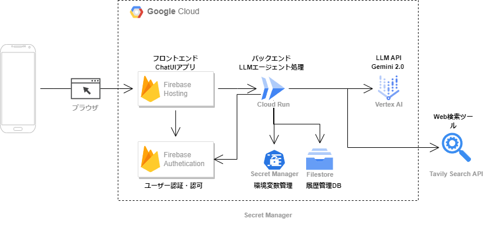

# Chat Reflection Loop: LLM対話を活用した自己分析と成長支援ツール

## コンセプト概要

Chat Reflection Loopは、日々のLLM（ChatGPT、Geminiなど）との対話履歴を振り返ることで、ユーザーの思考パターンや気づきを明確化し、自己成長を促すツールです。

## はじめに

日々の業務やプライベートでLLM（ChatGPTやGeminiなど）を活用する中で、私自身も「会話の断絶」や「同じ指示の繰り返し」に直面することがありました。  
そこで、LLMとの対話履歴を活用して自己理解を深め、継続的な成長を支援する仕組みを作りたいと考え、「Chat Reflection Loop」を開発するに至りました。  
本記事では、プロジェクトの背景、課題認識、実装の詳細について説明します。

## 🎯 対象ユーザーと課題

以下、ターゲットユーザーの記載を以下のように修正する提案です。従来の「自己成長に興味がある」や「メンタリング・コーチング」に加え、普段の対話の中で自然に気づきを得たいユーザー層にフォーカスする表現に変更しました。

### ターゲットユーザー

- **日常的にLLMチャットアプリを活用しているユーザー**  
  すでにChatGPTやGeminiなどのLLMを業務やプライベートで使っており、日常の対話の中から自然にインサイトや気づきを得たいと考えるユーザー

- **従来の単発チャットでは物足りなさを感じているユーザー**  
  対話履歴から自分自身の思考パターンや変化を確認したいと考え、無理なく継続的な学びや気づきを得られる仕組みを求めるユーザー

### 解決したい課題
1. **会話の文脈の断絶**
   - 単発のLLMチャットでは、過去の対話からの学びが得られにくい
   - 自身の思考パターンや変化が把握しづらい

2. **フィードバックループの欠如**
   - 同じ質問や課題に対する繰り返しの対話が多く、成長の振り返りが不足
   - 実践的なフィードバックが得られにくい

3. **インサイトの見落とし**
   - 有益な気づきやパターンが散逸し、記録・分析が行われない
   - 長期的な自己成長を実感しにくい

## 💡 実装済みの機能

### 1. スマートチャットインターフェース
- ユーザーごとのチャットセッション管理
- 会話履歴の保存と表示
- 直感的なUI/UXデザイン

### 2. 振り返り支援システム
- チャットセッションごとの振り返りノートを自動生成
- 重要な気づきの自動抽出
- ノートの閲覧・管理機能

### 3. 行動パターン分析
- ユーザーの行動傾向をラベル化し、パターンを可視化
- コミュニケーションスタイルの分析結果を表示

## 🔧 システムアーキテクチャ

## アーキテクチャ概要

本システムでは、**フロントエンド**からのユーザー操作を受け取り、**Firebase Authentication**で認証を行ったうえで、**Cloud Run**上のバックエンド(LLMエージェント)が処理を行う構成です。バックエンドは、**Vertex AI（Gemini 2.0）**をはじめとするLLM APIや**Tavily Search API**による検索機能を活用し、各種LLM処理や検索結果の取得を行います。履歴データなどは**Filestore**に保存し、**Secret Manager**で機密情報を一元管理します。インフラ構築とデプロイには**Terraform**を使用し、継続的なスケーラビリティとセキュリティを担保しています。

### ユーザーフローの全体像

1. **ユーザーがブラウザやスマホアプリ（Flutter）でアクセス**
   - フロントエンド（Web/Android）アプリは**Firebase Hosting**でホスティング
   - 同じFlutterコードベースからWeb/ネイティブアプリの双方を展開可能

2. **Firebase Authenticationによる認証・認可**
   - ユーザーのログイン・ログアウト処理を担当
   - フロントエンドから得られたトークンをもとにバックエンド側で権限を検証

3. **Cloud Run上のバックエンド(LLMエージェント)**
   - **FastAPI**ベースでAPIエンドポイントを提供
   - **PydanticAI + TavilyAI**や独自LLMエージェントのロジックを組み込み
   - ユーザーのチャットリクエストや履歴、認証トークンを受け取り、ビジネスロジックを実行

4. **LLM処理・外部検索の呼び出し**
   - **Vertex AI (Gemini 2.0)** などのLLM APIを呼び出し、チャット応答や振り返りメモ生成などを実行
   - **Tavily Search API**等の検索ツールにクエリを投げ、外部リソースや関連情報を取得

5. **履歴データの保存・検索**
   - チャット履歴や振り返りメモを**Filestore**に保存
   - 新たに実装予定の検索機能により、過去の振り返りノートや関連メモを参照可能に

6. **Secret Managerでの機密管理**
   - LLM APIキーやDB接続情報などの機密情報を一元管理
   - Cloud IAMとの組み合わせでアクセスを厳密に制限

7. **Terraformによるインフラ管理**
   - IaC(Infrastructure as Code)を採用し、Cloud RunやFirebaseなどのリソースを自動構成
   - スケールアップ／スケールダウンや新規環境の構築を迅速かつ安全に実施

---

## 技術スタックの特徴

1. **フロントエンド**
   - **Flutter**によるマルチプラットフォーム対応（Web/Android）
   - 直感的なチャットUIと過去履歴の閲覧UIを提供  
   - **Firebase Hosting**での公開

2. **バックエンド (FastAPI + PydanticAI)**
   - **FastAPI**によりAPIを実装し、Firebase Authトークンなど認証情報を検証
   - **PydanticAI + TavilyAI**によるメインチャット検索・LLMエージェントロジック
   - チャット履歴から振り返りメモを生成するLLM処理
   - 振り返りメモを元にユーザーの傾向を分析

3. **インフラストラクチャ**
   - **Cloud Run**コンテナ上でスケーラブルにバックエンドを稼働
   - **Firebase Authentication**でユーザー認証・認可を実施
   - **Filestore**でチャット履歴を管理
   - **Secret Manager**でAPIキーや認証情報を安全に保管
   - **Terraform**によるIaCで自動デプロイ・管理

## 時間切れで取り組めなかった内容
1. **チャット応答の改善機構の実装**
   - ユーザーの傾向によるLLMの応答改善（FewShotプロンプトへの動的な組み込み）
   - ラベルのクラスタリングと詳細な傾向分析

2. **検索・参照機能の追加**
   - 過去の振り返りノートの検索機能
   - 関連する振り返りの自動推薦システム

3. **コラボレーション機能**
   - 振り返りメモの共有機能
   - ユーザー間のチャット連携

4. **その他**
   - Androidアプリ対応
   - Web検索のGoogle Custom Search API化

## 🔗 リンク
- [GitHubリポジトリ](https://github.com/yourusername/chat_reflection_loop)
- [デモ動画へのリンク]

---
## 🔍 アイディアソンに参加しようと思った背景
> ここからは少し羽目を外す

### 開発者のレベル
- 業務でLLM活用推進のPoCを1年半ほど実施。主にクローズドデータを活用したRAGの検証
- Pythonを使い、LLMを活用したRAGのチューニングや簡単なプロトタイプ作成の経験があり

### 参加背景
1. **LLMコーディングツールとの出会い**
   - 約3か月前から、Cline(後にFork先のRooCodeに乗り換え)というLLMコーディングツールに触れはじめ、急激にLLMを使う量が増える
   - LLMの力を借りながらであれば、今まで自身では時間等の制約でできなかったことが実現できると感じ、開発への意欲が高まる 
   - 個人開発でのAPIコストが課題だったが、Google Cloudのクレジット（300ドル）につられ今回のアイディアソンへの参加を決定

2. **新たな技術への挑戦**
   - 今回のプロジェクトでは、以下のようなほぼ触ったことのない技術を使ってみた。改めてみると結構多い。  
     - **クラウド：** Google Cloud（普段はAWSを主に利用）
     - **フロントエンド：** Flutter（普段はPython中心の環境）
     - **IaC：** Terraform（AWS CDKやServerlessの利用経験はあり）
     - **バックエンド（エージェントフレームワーク）：** PydanticAI（Langchain、LangGraphの経験はあり）
     - **LLM：** Vertex AI系を利用（Azure Open AI Service/ AWS Bedrockの経験はあり）

### 気づきと反省
- **気づき：**  
  LLMに開発を指示する際に細かい設定を自分で行うよりも、LLM側が行おうとしている得意分野に任せたほうが効率的であると感じる面があった。当初の構成からLLMが書きやすい実装に方針を変えた部分もあり、それにより何とか期限内にそれっぽいアプリができたことにつながったと思っている。
  また、この開発経験から、自分の中にも「こうしたい」という無意識な好みの傾向があることに気づき、本アプリのコンセプトにいたる。

- **反省点：**  
  アイディアを練る前にクラウド側の構成を先に完成させた結果、最初に作成したチャットアプリは面白みに欠けるものとなってしまった。（ある意味力試しはここで終わって満足しかけてしまった）
  本来は、アイディアを実現するのはアプリケーションレイヤ―だけでなく、クラウドアーキテクチャから設計できるとより良いものがあるような気がします。せっかくIaCで作ったので、ユーザーとの対話によるサーバレスで自動で新規ツールが追加されて、チャットアプリが勝手に進化するとかできたら面白いのになぁと。どなたかそんな感じの構成を実現できてる方いないかしら？

