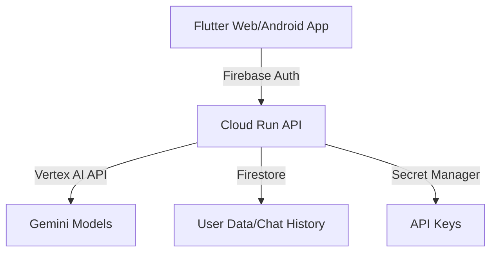

# Chat Reflection Loop: LLM対話を活用した自己分析と成長支援ツール

## コンセプト概要

Chat Reflection Loopは、日々のLLM（ChatGPT、Geminiなど）との対話履歴を振り返ることで、ユーザーの思考パターンや気づきを明確化し、自己成長を促すツールです。

## はじめに

日々の業務やプライベートでLLM（ChatGPTやGeminiなど）を活用する中で、私自身も「会話の断絶」や「同じ指示の繰り返し」に直面することがありました。  
そこで、LLMとの対話履歴を活用して自己理解を深め、継続的な成長を支援する仕組みを作りたいと考え、「Chat Reflection Loop」を開発するに至りました。  
本記事では、プロジェクトの背景、課題認識、実装の詳細について説明します。

## 🎯 対象ユーザーと課題

以下、ターゲットユーザーの記載を以下のように修正する提案です。従来の「自己成長に興味がある」や「メンタリング・コーチング」に加え、普段の対話の中で自然に気づきを得たいユーザー層にフォーカスする表現に変更しました。

### ターゲットユーザー

- **日常的にLLMチャットアプリを活用しているユーザー**  
  すでにChatGPTやGeminiなどのLLMを業務やプライベートで使っており、日常の対話の中から自然にインサイトや気づきを得たいと考えるユーザー

- **従来の単発チャットでは物足りなさを感じているユーザー**  
  対話履歴から自分自身の思考パターンや変化を確認したいと考え、無理なく継続的な学びや気づきを得られる仕組みを求めるユーザー

### 解決したい課題
1. **会話の文脈の断絶**
   - 単発のLLMチャットでは、過去の対話からの学びが得られにくい
   - 自身の思考パターンや変化が把握しづらい

2. **フィードバックループの欠如**
   - 同じ質問や課題に対する繰り返しの対話が多く、成長の振り返りが不足
   - 実践的なフィードバックが得られにくい

3. **インサイトの見落とし**
   - 有益な気づきやパターンが散逸し、記録・分析が行われない
   - 長期的な自己成長を実感しにくい

## 💡 実装済みの機能

### 1. スマートチャットインターフェース
- ユーザーごとのチャットセッション管理
- 会話履歴の保存と表示
- 直感的なUI/UXデザイン

### 2. 振り返り支援システム
- チャットセッションごとの振り返りノートを自動生成
- 重要な気づきの自動抽出
- ノートの閲覧・管理機能

### 3. 行動パターン分析
- ユーザーの行動傾向をラベル化し、パターンを可視化
- コミュニケーションスタイルの分析結果を表示

## 🔧 システムアーキテクチャ

### 技術スタックの特徴

1. **フロントエンド (Flutter)**
   - マルチプラットフォーム対応（Web/Android）
   - リアルタイムな応答表示（SSE）
   - 直感的なチャットUI

2. **バックエンド (FastAPI)**
   - 非同期処理による高パフォーマンス
   - Vertex AIとの連携による強力なLLM機能
   - セキュアなデータ管理

3. **インフラストラクチャ**
   - Cloud Runによるスケーラブルな実行環境
   - Firebaseによる堅牢な認証・データ管理
   - Terraformによる自動化されたデプロイ

## 💪 技術的な強み

### 1. セキュアなアーキテクチャ
- Firebase Authenticationによる強固な認証
- Cloud IAMを用いた細かいアクセス制御
- Secret Managerによる機密情報の保護

### 2. 拡張性の高い設計
- マイクロサービスアーキテクチャの採用
- コンテナ化による環境の一貫性の維持
- インフラのコード化（IaC）で迅速なスケーリング

## 時間切れで取り組めなかった内容
1. **チャット応答の改善機構の実装**
   - ユーザーの傾向によるLLMの応答改善（FewShotプロンプトへの動的な組み込み）
   - ラベルのクラスタリングと詳細な傾向分析

2. **検索・参照機能の追加**
   - 過去の振り返りノートの検索機能
   - 関連する振り返りの自動推薦システム

3. **コラボレーション機能**
   - 振り返りメモの共有機能
   - ユーザー間のチャット連携

4. **モバイル対応**
   - Androidアプリ対応

## 🔍 アイディアソンに参加しようと思った背景

### 開発者のレベル
- 業務でLLM活用推進のPoCを1年半ほど実施。主にクローズドデータを活用したRAGに取り組んできました。
- Pythonを使い、LLMを活用したRAGのチューニングや簡単なプロトタイプ作成の経験があります。

### 参加背景
1. **LLMコーディングツールの感動**
   - 約3か月前から、Cline/RooCodeというツールに触り、その可能性に大きな感動を覚えました。  
   - 今までできなかったことも、LLMの力を借りれば実現できると感じ、開発への意欲が高まりました。  
   - 個人開発でのAPIコストが課題でしたが、今回のアイディアソンでは、Google Cloudのクレジット（約300ドル）につられ良い機会なので参加を決めました

2. **新たな技術への挑戦**
   - 今回のプロジェクトでは、以下のようなほぼ触ったことのない技術に挑戦しました。  
     - **クラウド：** Google Cloud（普段はAWSを主に利用）
     - **フロントエンド：** Flutter（普段はPython中心の環境）
     - **IaC：** Terraform（AWS CDKやServerlessの利用経験はあり）
     - **バックエンド（エージェントフレームワーク）：** PydanticAI（Langchain、LangGraphの経験はあり）
     - **LLM：** Vertex AI系を利用（Azure Open AI Service/ AWS Bedrockの経験はあり)

### 気づきと反省
- **気づき：**  
  LLMに開発を指示する際に細かい設定を自分で行うよりも、LLM側が行おうとしている得意分野に任せたほうが効率的であると感じる面がありました。
  結果、当初の構成から方針を変えた部分もあり、何とか期限内にそれっぽいアプリにたどりつけた理由の一つです
  この開発経験から、自分の中にも「こうあるべき」という無意識な偏りがあることに気づき、本アプリのコンセプトにつながっています。

- **反省点：**  
  アイディアを練る前にクラウド側の構成を先に完成させた結果、最初に作成したチャットアプリは面白みに欠けるものとなってしまいました。（ある意味力試しはここで終わって満足しかけてしまった）
  本来は、アイディアを実現するのはアプリケーションレイヤ―だけでなく、クラウドアーキテクチャから設計できるとより良いものがあるような気がします。せっかくIaCで作ったので、ユーザーとの対話によるサーバレスで自動で新規ツールが追加されて、チャットアプリが勝手に進化するとかできたら面白いのになぁと。どなたかそんな感じの実現できてる方いないかしら？

## 🎥 デモ動画

[デモ動画へのリンク]

## 🔗 参考リンク

- [GitHubリポジトリ](https://github.com/yourusername/chat_reflection_loop)
- [プロジェクトドキュメント](/docs)
- [API仕様書](/backend/README.md)